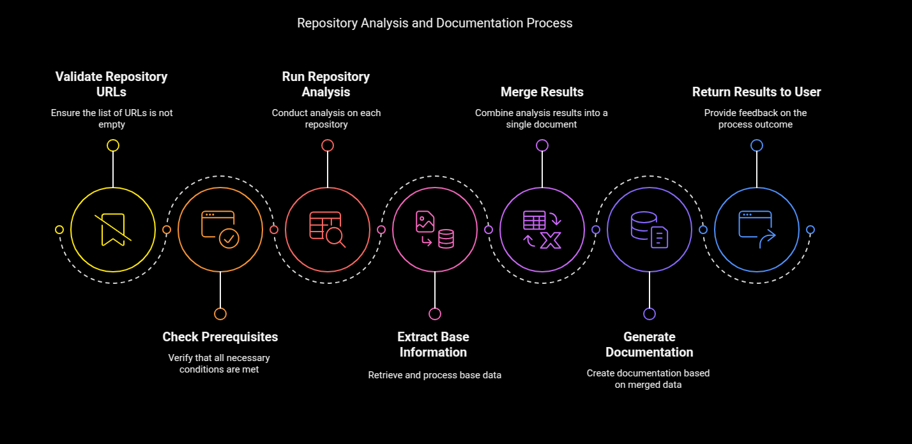

# Workflow Automation

A modular and scalable workflow automation system built with Prefect, designed to orchestrate AI workflows data processing tasks with ease.

## 🔍 Overview

This project provides a framework for creating, managing, and monitoring automated workflows. It's built to be extensible, allowing for simple integration of new tools, data sources, and custom processes.

## 🔄 Workflows

<details>
<summary><strong>Repository Analysis Flow</strong> - Analyze and document code repositories</summary>
<br>

This workflow analyzes GitHub repositories, extracts key information, and generates documentation.

Still WIP, but it's usable

#### Workflow Diagram
<div align="center">
    
</div>

#### Key Features
- Automatic repository cloning and analysis
- Code structure extraction and documentation 
- AI-powered insights generation
- Markdown report creation
- Data storage with AioTinyDB

#### Example Usage
```bash
docker compose up -d # Setup Local Prefect

uv venv
source .venv/bin/activate
uv pip install .

doc-gen 


```

[View detailed workflow diagram →](assets/analyze_and_document_repos.md)
</details>

## 🐳 Setup & Installation

The project includes a multi-stage Docker build system with several options for local development and deployment:

**Docker Compose Structure**:

- `postgres`: Database for Prefect server
- `prefect`: Prefect server for workflow orchestration
- `workflow-agent`: Prefect agent 
- `development`: Development environment with all dependencies


### Workflow Agent

This container runs a Prefect agent that executes your deployed workflows:

```bash
# Build and start the workflow-agent
docker compose up -d workflow-agent
```

### Development Environment

For local development with all dependencies pre-installed:

```bash
# Start the development container
docker compose up -d development

# Connect to the development container
docker compose exec development bash
```


### Manual Build

You can also build the Docker images separately:

```bash
# Build the production image
docker build -t workflow-automation:latest .

# Build the development image
docker build -t workflow-automation:dev -f Dockerfile.dev .
```


## 🚀 Getting Started

Run the repository analysis and documentation workflow:

```bash
make example
#or
docker compose exec development doc-gen --urls https://github.com/nielstron/demjson3
```


**Example usage:**

```bash
doc-gen --urls https://github.com/nielstron/demjson3
```
Multiple URLs:
```bash
doc-gen --urls-file sample_repos.txt
```
Private repo(make sure `.env` is configured and has `GITHUB_TOKEN`):
```bash
doc-gen --urls https://github.com/your_org/private_repo --private
```


For detailed workflow information, see the [workflow documentation](assets/analyze_and_document_repos.md).


## 🔑 Prerequisites

The following API keys are required for full functionality:

```bash
# Required for AI-powered code analysis
export OPENROUTER_API_KEY=your_openrouter_key_here

# Required for accessing private repositories
export GITHUB_TOKEN=your_github_token_here

# Optional for advanced logging and tracing
export LOGFIRE_API_KEY=your_logfire_key_here
```

You can also add these to your `.env` file:

```
OPENROUTER_API_KEY=your_openrouter_key_here
GITHUB_TOKEN=your_github_token_here
LOGFIRE_API_KEY=your_logfire_key_here
```

Note:
- OPENROUTER_API_KEY is required for all workflows that use AI-powered analysis
- GITHUB_TOKEN is only required when analyzing private repositories
- LOGFIRE_API_KEY is optional, used for tracing and advanced logging capabilities


## 🙏 Credits

This project leverages several amazing open-source tools:

- [Prefect](https://www.prefect.io/) - The workflow orchestration engine that powers our automation
- [Logfire](https://logfire.dev/) - For structured logging capabilities
- [Pydantic](https://docs.pydantic.dev/) & [Pydantic AI](https://github.com/pydantic/pydantic-ai) - For data validation and structured outputs
- [TinyDB](https://tinydb.readthedocs.io/) - A lightweight document-oriented database
- [Tiktoken](https://github.com/openai/tiktoken) - For token counting and management

## 📄 License

This project is licensed under the MIT License - see the [LICENSE](LICENSE) file for details. 