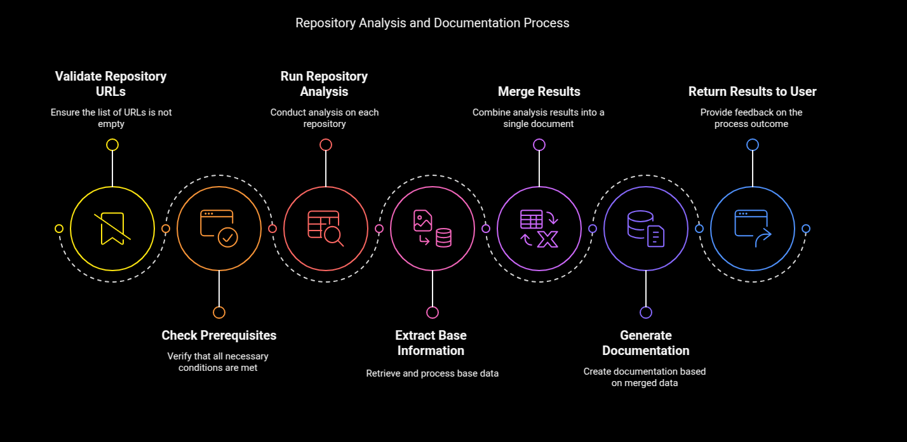

# Workflow Automation

A modular and scalable workflow automation system built with Prefect, designed to orchestrate AI workflows data processing tasks with ease.

## 🔍 Overview

This project provides a framework for creating, managing, and monitoring automated workflows. It's built to be extensible, allowing for simple integration of new tools, data sources, and custom processes.

## 🔄 Workflows

<details>
<summary><strong>Repository Analysis Flow</strong> - Analyze and document code repositories</summary>
<br>

This workflow analyzes GitHub repositories, extracts key information, and generates documentation.

#### Workflow Diagram
<div align="center">
    
</div>

#### Key Features
- Automatic repository cloning and analysis
- Code structure extraction and documentation 
- AI-powered insights generation
- Markdown report creation
- Data storage with AioTinyDB

#### Example Usage
```python
from workflows.repo_analysis import analyze_repositories

result = analyze_repositories(
    github_repo_urls=["https://github.com/example/repo"],
    output_dir="./documentation"
)

print(f"Documentation generated at: {result.documentation_paths}")
```

[View detailed workflow diagram →](assets/analyze_and_document_repos.md)
</details>

## 🛠️ Setup & Installation

```bash
# Clone the repository
git clone https://github.com/your-org/phoenixsec-workflow-automation.git

# Install uv package manager
pip install uv

# Install dependencies using uv
uv install .

# Create Docker network for Prefect
docker network create prefect-dev-network

# Start the infrastructure services
docker compose up -d
```

## 🚀 Getting Started

Run the repository analysis and documentation workflow:

```bash
python analyze_and_document_repos.py
```

For detailed workflow information, see the [workflow documentation](assets/analyze_and_document_repos.md).

## 📚 Documentation

For detailed documentation on creating custom workflows, tasks, and integrating with external systems, see the [docs folder](./docs).

## 🙏 Credits

This project leverages several amazing open-source tools:

- [Prefect](https://www.prefect.io/) - The workflow orchestration engine that powers our automation
- [Logfire](https://logfire.dev/) - For structured logging capabilities
- [Pydantic](https://docs.pydantic.dev/) & [Pydantic AI](https://github.com/pydantic/pydantic-ai) - For data validation and structured outputs
- [TinyDB](https://tinydb.readthedocs.io/) - A lightweight document-oriented database
- [Tiktoken](https://github.com/openai/tiktoken) - For token counting and management

## 📄 License

This project is licensed under the MIT License - see the [LICENSE](LICENSE) file for details. 