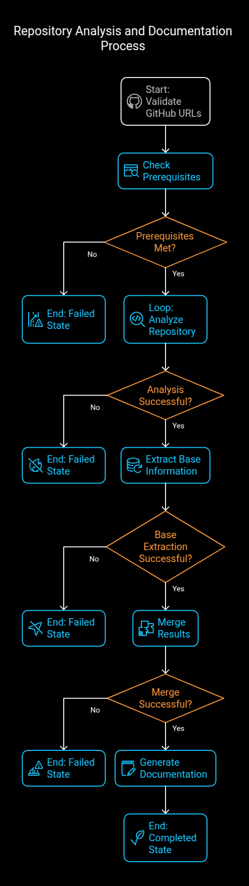

# Workflow Automation

A modular and scalable workflow automation system built with Prefect, designed to orchestrate AI workflows data processing tasks with ease.

## 🔍 Overview

This project provides a framework for creating, managing, and monitoring automated workflows. It's built to be extensible, allowing for simple integration of new tools, data sources, and custom processes.

## 🔄 Workflows

<div align="center">
    
</div>

### Key Workflows

- **Repository Analysis Flow**  
  <div align="left">
      
  </div>

## 🛠️ Setup & Installation

```bash
# Clone the repository
git clone https://github.com/your-org/phoenixsec-workflow-automation.git

# Install uv package manager
pip install uv

# Install dependencies using uv
uv install .

# Create Docker network for Prefect
docker network create prefect-dev-network

# Start the infrastructure services
docker compose up -d
```

## 🚀 Getting Started

Run the repository analysis and documentation workflow:

```bash
python analyze_and_document_repos.py
```

For detailed workflow information, see the [workflow documentation](assets/analyze_and_document_repos.md).

## 📚 Documentation

For detailed documentation on creating custom workflows, tasks, and integrating with external systems, see the [docs folder](./docs).

## 📄 License

This project is licensed under the MIT License - see the [LICENSE](LICENSE) file for details. 