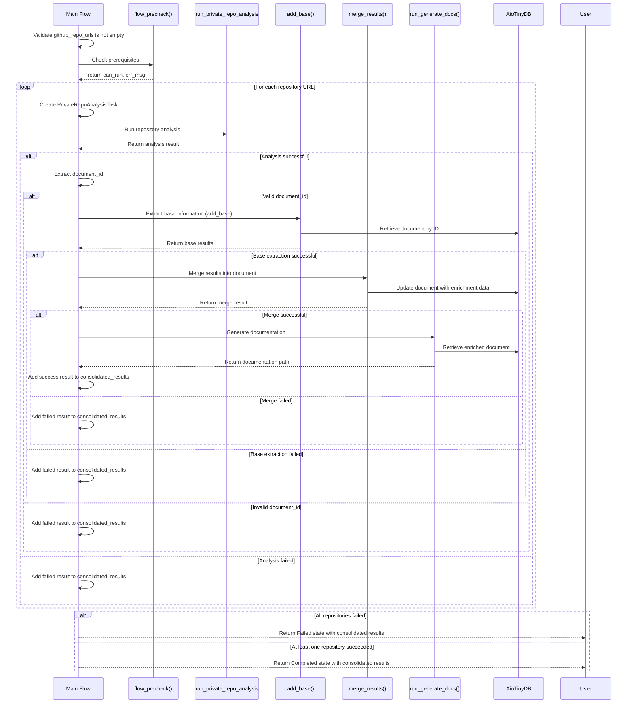

```mermaid
sequenceDiagram
    participant Main as Main Flow
    participant Check as flow_precheck()
    participant RepAnalysis as run_private_repo_analysis
    participant Base as add_base()
    participant Merge as merge_results()
    participant DocGen as run_generate_docs()
    participant DB as AioTinyDB
    
    Main->>Main: Validate github_repo_urls is not empty
    Main->>Check: Check prerequisites
    Check-->>Main: return can_run, err_msg
    
    loop For each repository URL
        Main->>Main: Create PrivateRepoAnalysisTask
        Main->>RepAnalysis: Run repository analysis
        RepAnalysis-->>Main: Return analysis result
        
        alt Analysis successful
            Main->>Main: Extract document_id
            
            alt Valid document_id
                Main->>Base: Extract base information (add_base)
                Base->>DB: Retrieve document by ID
                Base-->>Main: Return base results
                
                alt Base extraction successful
                    Main->>Merge: Merge results into document
                    Merge->>DB: Update document with enrichment data
                    Merge-->>Main: Return merge result
                    
                    alt Merge successful
                        Main->>DocGen: Generate documentation
                        DocGen->>DB: Retrieve enriched document
                        DocGen-->>Main: Return documentation path
                        Main->>Main: Add success result to consolidated_results
                    else Merge failed
                        Main->>Main: Add failed result to consolidated_results
                    end
                else Base extraction failed
                    Main->>Main: Add failed result to consolidated_results
                end
            else Invalid document_id
                Main->>Main: Add failed result to consolidated_results
            end
        else Analysis failed
            Main->>Main: Add failed result to consolidated_results
        end
    end
    
    alt All repositories failed
        Main-->>User: Return Failed state with consolidated results
    else At least one repository succeeded
        Main-->>User: Return Completed state with consolidated results
    end
```